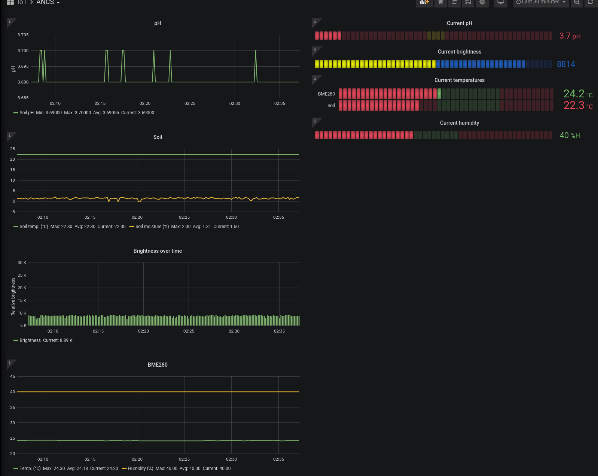

#### ANCS
**A**bsolutely **N**o **C**limate **S**cepticism, **ANCS** for the lazy ones like myself, is a small-ish software used
to monitor climate variables when home-growing vegetables and plants.

As of yet it is in an early but working beta if you have the same sensors as my own setup, which consists of:
- RaspberryPi 3,
- [Tentacle T3](https://www.whiteboxes.ch/shop/tentacle-t3-for-raspberry-pi/) for RPi,
- [Catnip's soil sensor](https://www.whiteboxes.ch/shop/i2c-soil-moisture-sensor/),
- [a BME280 sensor](https://www.adafruit.com/product/2652),
- [Atlas Scientific EZO pH circuit](https://www.whiteboxes.ch/shop/ezo-ph-circuit/)
- [Atlas Scientific consumer-grade sensor](https://www.whiteboxes.ch/shop/consumer-grade-ph-probe/).

> Disclaimer
>
> This list is given so you can compare what you have to what's implemented, I am in no way affiliated to
> this particular shop (I just like being able to order everything I need on a single webshop, and they offer the T3).

The documentation is currently not my point of focus but it will get better in time.

#### How it works
The app is to be run by uWSGI and registers available sensors via a system of drop-ins.
Each drop-in allows for the app to perform periodic calls to take measures (or perform any type of task really)
and expose them using [Prometheus](https://prometheus.io/).

Prometheus is then queried by [Grafana](https://grafana.com/) which in turns displays nice graphs for monitoring like so:

#### Installation
> WARNING
>
> Under construction, more will come later.

If you can find your way around this yourself, install python3, all required dependencies, and fire uWSGI like so:
`uwsgi --http 0.0.0.0:8000 --enable-threads --wsgi-file ancs/ancs.py --callable app`

The `--enable-threads` is mandatory, else the background watcher will not start.
